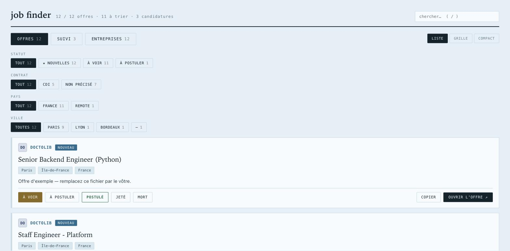
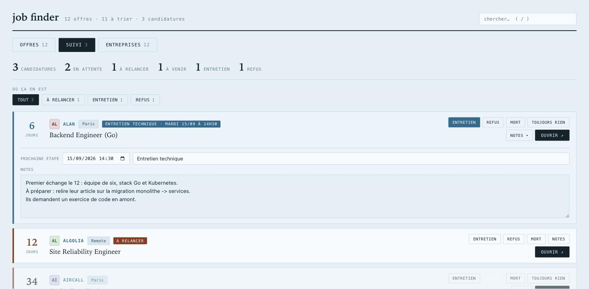
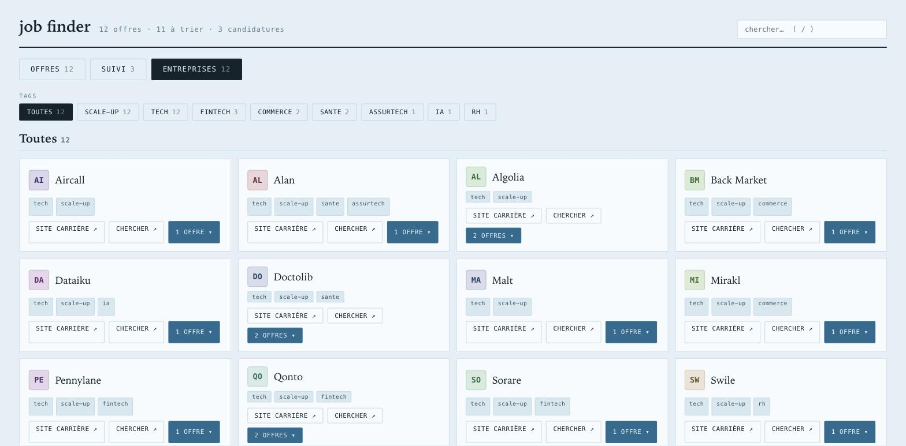

# job-finder

*Votre veille d'emploi, en local, pilotée par votre agent de code.*

Une page qui va chercher de vraies offres sur les sites carrière de 89 entreprises, les
filtre selon **votre** profil, et vous les fait trier d'un clic. Pas de compte, pas de
base de données, pas une seule dépendance : Python 3 et sa bibliothèque standard.



---

## Le plus simple : laissez votre agent l'installer

Ce projet est **conçu pour être utilisé avec un agent de code local** — Claude Code,
Codex, Aider, Cursor, peu importe. Le dépôt contient un [`AGENTS.md`](AGENTS.md) qui lui
dit tout : les commandes, les questions à vous poser, les règles à respecter.

Clonez, ouvrez votre agent dans le dossier, et collez ceci :

```
Lis AGENTS.md. Installe et configure job-finder pour moi : pose-moi les questions
dont tu as besoin pour écrire mon profil de recherche, lance une première collecte,
puis ouvre-moi la page.
```

Il vous demandera quels postes vous visez, ce qui vous ferait fermer une annonce tout de
suite, où vous cherchez, et quel type de contrat. Puis il écrira votre `profil.json`,
lancera la collecte et vous montrera le résultat. Comptez dix minutes.

**Pourquoi passer par un agent ?** Parce que le cœur de l'outil — le filtre — est votre
CV en creux, et qu'il se règle en conversation, pas en configuration. Et parce que tout
ce qui manque ici se rajoute vite : une plateforme de recrutement absente, c'est une
fonction de trente lignes ; une entreprise à brancher, une ligne de JSON.

## À la main, si vous préférez

```bash
git clone https://github.com/MattisDarwin/job-finder
cd job-finder

cp profil.exemple.json profil.json      # votre profil de recherche : à réécrire
cp data.exemple.js data.js              # la base de départ

python3 sites-carriere.py               # une passe de collecte (2 à 5 min)
open ouvrir.command                     # sert la page et démarre le serveur
```

Sous Linux ou Windows, remplacez la dernière ligne par `python3 serveur.py` puis ouvrez
`http://127.0.0.1:4612/`.

**N'ouvrez jamais `index.html` par double-clic** : la page s'affiche, mais aucun
changement de statut n'est enregistré, faute de serveur.

---

## Ce que ça fait

**Offres.** Les annonces collectées, filtrées sur l'intitulé et le lieu. Cinq boutons par
carte : à voir, à postuler, postulé, jeté, mort. Filtres par statut, contrat, pays, ville.
Trois densités d'affichage.

**Suivi.** Ce à quoi vous avez postulé, et depuis combien de jours. Vous y déclarez la
suite — entretien, refus, sans suite — vous notez ce qui s'est dit au téléphone, vous
fixez la prochaine échéance. Quand une date approche, elle passe devant : elle remplace le
compteur de jours et remonte la candidature en tête. Une relance est signalée au bout de
dix jours de silence.



**Entreprises.** Les 89 entreprises livrées avec le dépôt, filtrables par tag — `cac40`,
`tech`, `defense`, `suisse`, `sante`, `fintech`… Une entreprise en porte plusieurs.
Cliquer dessus déplie ses offres.



## Comment ça marche

`sites-carriere.py` interroge les **API publiques** des plateformes de recrutement.
Greenhouse, Lever, SmartRecruiters, Ashby, Recruitee, Workday, Phenom, Talentsoft,
Teamtailor, Radancy et Jibe publient toutes un point d'entrée JSON ou RSS **sans
authentification** : les entreprises veulent que leurs offres soient lues, c'est ainsi
qu'elles se diffusent. On ne scrape rien, on utilise la voie prévue, et on plafonne à
25 offres par entreprise et par passe.

`data.js` est la source de vérité unique — lue par la page, écrite par `serveur.py`, parce
qu'un navigateur ne peut pas écrire sur le disque.

## Le profil, c'est vous

Tout se joue dans `profil.json` :

```json
{
  "garde":  ["d[ée]veloppeu?r", "\\bpython\\b", "data\\s+engineer"],
  "ecarte": ["stages?\\b", "\\bvp\\b", "front[\\s-]?end"],
  "lieux":  ["paris", "lyon", "remote"]
}
```

Un intitulé doit contenir **au moins un** motif de `garde`. S'il contient un motif de
`ecarte`, il tombe — le rejet est évalué en premier et gagne toujours. Le lieu doit
contenir un mot de `lieux`.

`profil.exemple.json` est celui de Michel Dupont, développeur backend : commenté, il sert
de mode d'emploi par l'exemple.

**Le filtre est volontairement grossier.** Mieux vaut dix offres à écarter qu'une bonne
manquée — c'est vous qui triez ensuite, d'un clic. Et toute modification se teste **dans
les deux sens**, ce qui passe et ce qui tombe : un filtre qui écarte tout « marche » aussi
bien qu'un filtre qui garde tout.

## Ajouter une entreprise

```json
"Doctolib": { "plateforme": "greenhouse", "id": "doctolib", "tags": ["tech", "sante"] }
```

Encore faut-il savoir sur quelle plateforme elle est. C'est le travail de
`decouvrir-ats.py` : il part de l'adresse du site carrière, suit les redirections, lit la
page, essaie les sous-domaines d'emploi, puis frappe aux onze points d'entrée connus.

```bash
python3 decouvrir-ats.py "Nom de l'entreprise"
```

Ce qu'il rend est **une piste, pas une conclusion** — `/rss` existe aussi chez ceux qui
publient un blog. Relisez trois offres réelles avant d'inscrire la ligne.

## Les autres scripts

| | |
|---|---|
| `apprendre.py` | cherche ce que vos offres jetées ont en commun, et propose des mots à ajouter au filtre. Il propose, il n'applique rien. |
| `logos.py` | récupère une fois les icônes des entreprises et les range en base64 : la page reste hors ligne et n'annonce à personne ce que vous regardez. |
| `decouvrir.py` | teste des identifiants contre cinq API. Rapide, mais il confond les homonymes. |
| `decouvrir-workday.py` | trouve les identifiants Workday, qui ne se devinent pas. |

## Ce qui n'est pas fait

Volontairement. Repérer les offres dont le lien est mort. Une vue des annonces de plus de
trente jours. Brancher les entreprises sans API publique — il en reste beaucoup, et ça
demanderait de lire du HTML, ce que ce projet refuse pour l'instant.

Le registre est fait pour grossir et le filtre pour être réécrit : c'est le principe. Si
votre agent ajoute une plateforme ou vingt entreprises, la pull request est bienvenue.

## Licence

MIT.
